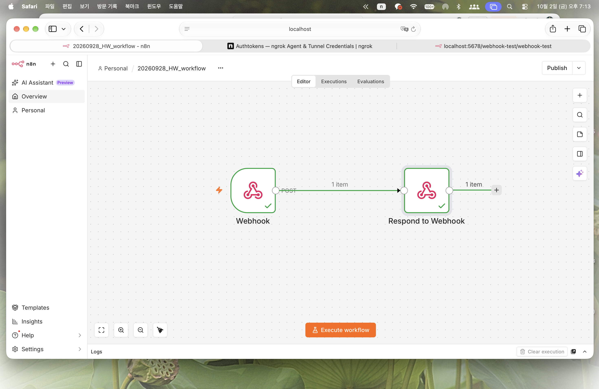
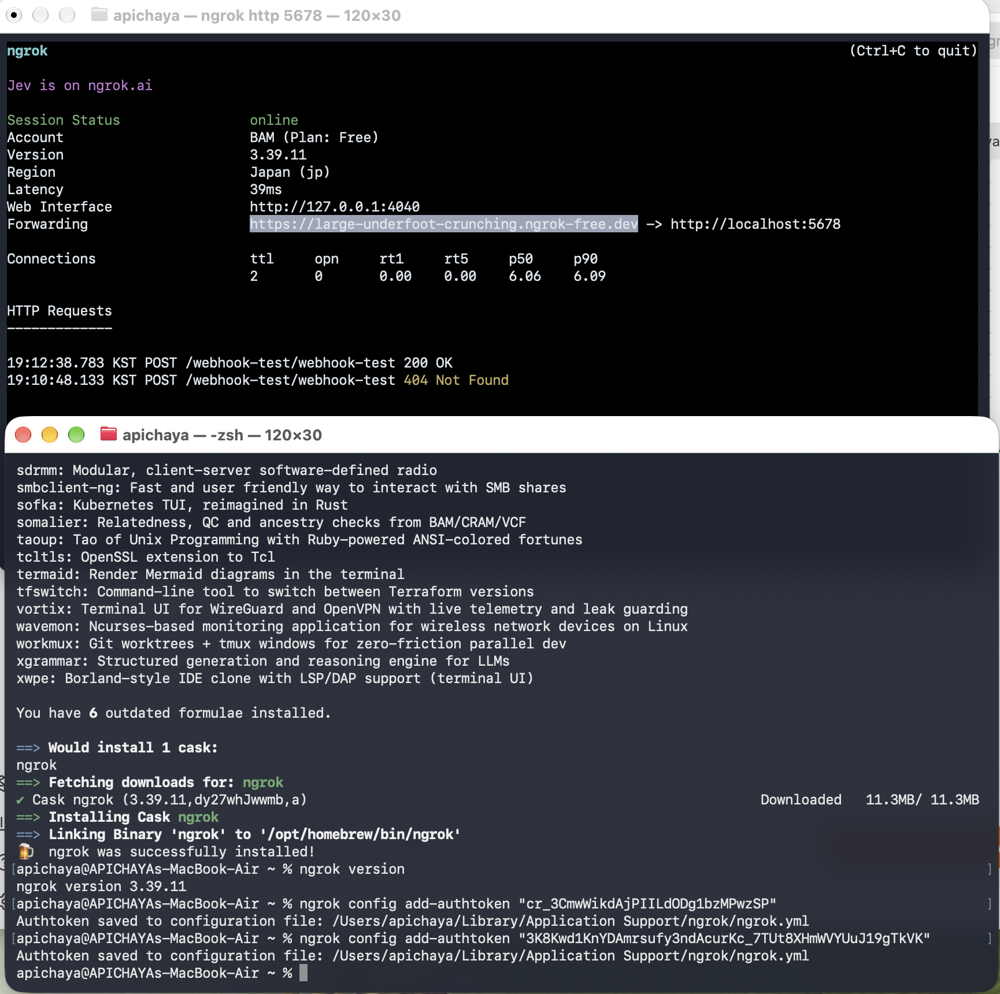
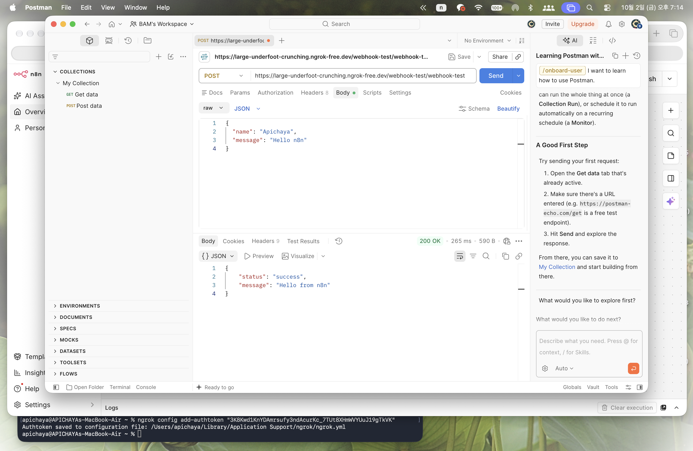

# n8n Webhook + ngrok Exercise

## Objective

This exercise demonstrates how to connect an external HTTP request
to an n8n Webhook using ngrok.

## Workflow

Postman → ngrok → localhost:5678 → n8n Webhook → Respond to Webhook

## Configuration

- HTTP Method: POST
- Webhook Path: webhook-test
- Authentication: None
- Response: Using Respond to Webhook Node

## Test Data

{
  "name": "Apichaya",
  "message": "Hello n8n"
}

## Result

The request was successfully received by n8n through the ngrok tunnel.

## Evidence

### 1. n8n Workflow

### 2. ngrok Forwarding

### 3. Postman Response

